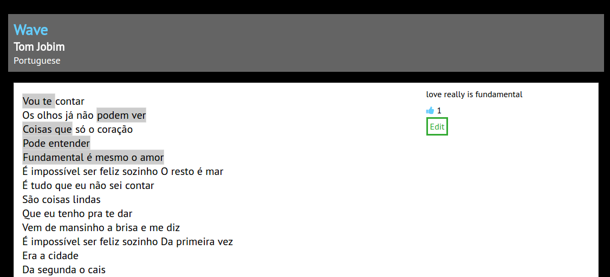

# Singuist #

[Singuist Live][host]

[host]: http://singuist.com

Singuist is a full-stack web application inspired by [Genius][genius]. It uses a Ruby on Rails backend, a PostgreSQL database, and
React.js with Redux on the frontend.

[genius]: http://genius.com

## Features & Implementation ##

### Tracks ###

The tracks are stored in a table in the database, which has columns
for `id`, `body`, `language`, `name`, `description`, and `artist`.

Tracks are rendered as `TrackIndexItem`s in the `TrackIndex`
component, which shows the track's `name` and `artist`, and in the
`TrackDetail` component, which shows all of the track's components.

Tracks are created through the `NewTrackForm` component, which render
a form for the user to fill in the details of a track.

### Annotation Creation and Rendering ###

Annotations are stored in a table in the database, with columns for
`id`, `user_id`, `track_id`, `body`, `start_index`, and `end_index`.
`start_index` and `end_index` represent the range of text that the
annotation is associated with in its track's lyrics.

Annotations are rendered in the `TrackDetail` component, which shows
annotations in two ways:



1. Track lyrics are highlighted in the places where there are
   annotations. This highlighting is done with the component's
   `stringToSpans` method (see below), which iterates through the
   lyrics, wrapping segments of the lyrics in HTML spans. A span may
   have an `annotation` class, which sets the span's background color
   to indicate that an annotation is present. When the user mouses
   over a `span.annotation`, the background color changes to indicate
   the range of text the annotation covers. When the user clicks a
   `span.annotation`, `TrackDetail` renders the details of the
   annotation.
2. `TrackDetail` contains a `.description` side panel that renders the
`body` of the annotation the user has clicked on, if any.
Users can edit and upvote existing annotations.

`stringToSpans` method:

```javascript
stringToSpans(string) {
    ...


    for (position = 0; position < length; position++) {
        if (inAnnotation) {
            const annoId = annotationEnds[position];

            if (isValidAnnotation(annoId)) {
                const span = (
                    <Link to={addressOf(annoId)}>
                        <span
                           key={position}
                           value={annoId}
                           className="annotation"
                           dangerouslySetInnerHTML={ { __html: body } }/>
                    </Link>
                );
                spans.push(span);
                toggleInAnnotation();
            }
        } else if (isValidAnnotation(annotationStarts[position])) {
            const span = (
                <span key={position || 0}
                      dangerouslySetInnerHTML={ { __html: body } }/>
            );
            spans.push(span);
            toggleInAnnotation();
        }
        body += string[position];
    }

    spans.push(<span key={length} dangerouslySetInnerHTML={ { __html: body }}/>);
    return spans;
}
```

If a user wants to create an annotation, they highlight the range of
text they wish to annotate, and enter the text of their annotation in
the `.description` side panel. The annotation's text entry is
implemented using Draft.js, which gives the user a clean, simple
writing experience.

## Future Directions For This Project ##

### Search ###

Search is a necessary feature for any lyrics website. I plan on using
the pg_search gem to create a fuzzy search of tracks going through
lyrics, name, artist and language.


### Google Translate Integration ###

To compare human translations side-by-side with automated
translations, I intend to connect to the Google Translate API.
For any given annotation, Google Translate will provide its own
translation alongside the user-provided translation.
